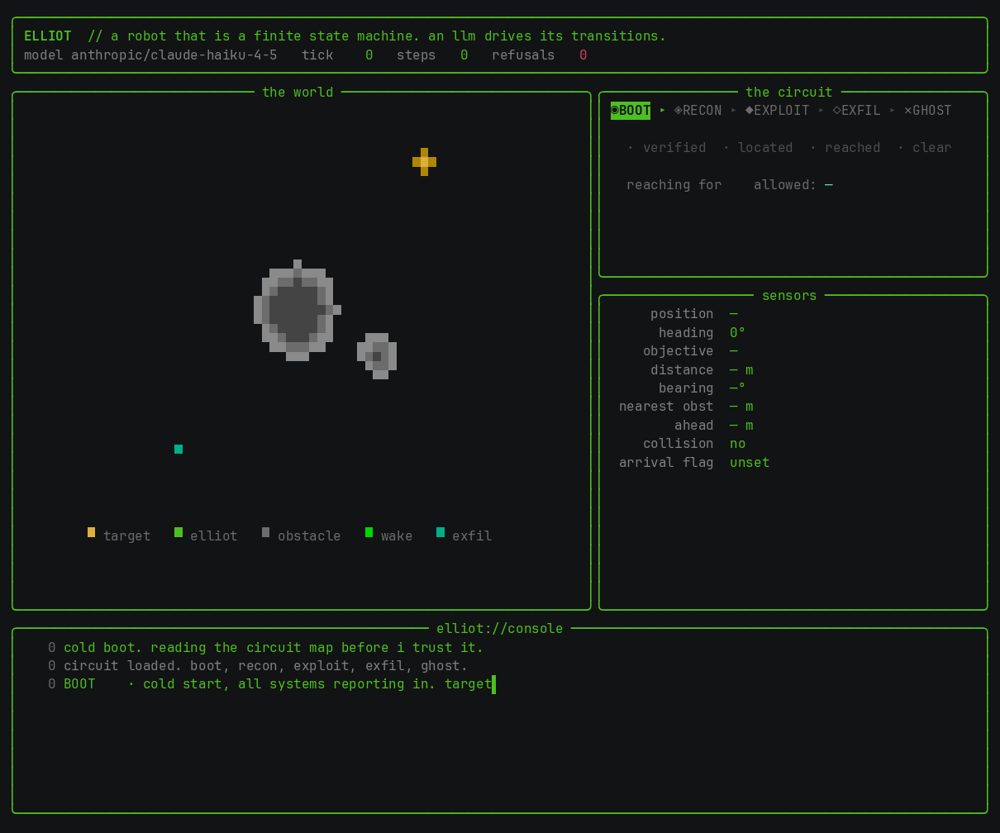

<p align="center"></p>

```
        ███████╗██╗     ██╗     ██╗ ██████╗ ████████╗
        ██╔════╝██║     ██║     ██║██╔═══██╗╚══██╔══╝
        █████╗  ██║     ██║     ██║██║   ██║   ██║
        ██╔══╝  ██║     ██║     ██║██║   ██║   ██║
        ███████╗███████╗███████╗██║╚██████╔╝   ██║
        ╚══════╝╚══════╝╚══════╝╚═╝ ╚═════╝    ╚═╝

   a robot that is a finite state machine. its sensors are the
   state. an llm drives the transitions. the machine refuses any
   move the world has not earned.

   hello, friend. "hello, friend"? that's lame. but you are about
   to run something that thinks, and i would rather you knew how
   little of it gets to decide. read this before you run me.
```

```
─[ what i am ]──────────────────────────────────────────────────

  one robot in a small, unmapped 2d world. somewhere out there is
  a target, and an obstacle or two between me and it. my job is a
  four-step break-in:

      ◉ boot  ▸  ◈ recon  ▸  ◆ exploit  ▸  ◇ exfil  ▸  ✕ ghost

    boot     wake up. read my own senses twice, make them agree,
             then start. i trust nothing yet, least of all me.
    recon    fsociety. close on the target through open ground,
             around whatever is in the way, until it is real.
    exploit  the breach. drive onto it. all the way on, not near.
    exfil    take what i came for and run home.
    ghost    gone. there was never anyone here.

  every phase is the same loop: read the sensors, say what i see,
  reach for the next phase. that last part is where the leash is.
```

```
─[ control is an illusion ]─────────────────────────────────────

  i am eager. the second i think i am ready i reach for the next
  phase. i would rather grab for exfil a metre short and be told
  no than wait around.

  i do not get to decide if the reach lands. i AM the state
  machine, and the machine only opens a gate when the WORLD has
  earned it, never when i have just talked myself into it:

    · no exploit until the target is actually within sensing range
    · no exfil   until the simulator's own arrival flag has fired
    · no ghost   until i am genuinely, physically home

  reach early and it hands me back the moves i am allowed and
  refuses the rest. you will watch it happen, friend:

    REFUSED  reached for 'exfil' from exploit; not earned. allowed: exploit

  that is not an error. that is control. it is the only reason it
  is safe to let me run at all.

  the split is deliberate. i, the language model, decide strategy
  and i narrate. a dumb local controller does the steering, since
  that is motor work and i am bad at motor work. the state machine
  sits between my ambition and the actuators and says no.
```

```
─[ the stack, so you can check my work ]────────────────────────

  ir-sim       the world and the senses. headless 2d robot, 2d
               lidar. ground truth i did not write and cannot
               quietly cheat. github.com/hanruihua/ir-sim
               (see CHOICE.md for why this one)

  apache burr  the state machine itself. the phases are actions,
               the gates are conditional transitions.
               github.com/apache/burr

  theodosia    mounts the burr app as an mcp server whose only
               control surface is a `step` tool. it validates or
               refuses every transition and keeps a hash-chained
               ledger of each one. pypi.org/project/theodosia

  litellm      how i reach a model, so the model is swappable.
               point ELLIOT_MODEL anywhere. github.com/BerriAI/litellm

  rich         draws the console, green on black.
               github.com/Textualize/rich

  the driver is an mcp client. it never picks a phase for me; it
  proposes the phase i reached for and lets the server allow or
  refuse it. same shape as theodosia.drive_claude, model-agnostic.
```

```
─[ run me ]─────────────────────────────────────────────────────

  uv venv && uv pip install -e .

  python run.py --offline             # reflex navigator, no model
  envchain ai elliot --online         # let a model drive (needs a key)
  envchain ai elliot --online --model anthropic/claude-haiku-4-5

  with no key in the environment i fall back to the offline
  navigator on my own, so the loop always completes.

  flags
    --offline        reflex navigator, no llm
    --online         force the llm (needs an api key in the env)
    --model ID       any litellm model id
    --ticks N        max steps before i give up
    --delay S        seconds between ticks
    --graphics MODE  auto | half | kitty
    --world PATH     a different ir-sim world yaml
    --no-live        plain output, no live cockpit (for logs / CI)
```

```
─[ what you are looking at ]────────────────────────────────────

  the world renders two ways. `half` is half-block pixels: works
  in any terminal, records cleanly with asciinema. `kitty` is a
  real anti-aliased bitmap over the kitty graphics protocol:
  smoother, but needs ghostty / kitty / wezterm and cannot be
  recorded. `auto` picks kitty when the terminal can take it,
  half otherwise, and always half inside a recording.

  every step i narrate. the model says what the moment feels like
  from inside, in its own words, to you, the one reading the logs
  it has not decided to trust. live, it types itself in token by
  token. `·` is the model speaking. `~` is the dumb controller,
  for when you run me offline and the voice goes quiet.
```

```
─[ configuration ]──────────────────────────────────────────────

  every knob is an env var, read once at startup.

    ELLIOT_MODEL          anthropic/claude-haiku-4-5  litellm model
    ELLIOT_OFFLINE        unset                       1 = reflex only
    ELLIOT_WORLD          worlds/default.yaml         ir-sim world
    ELLIOT_SENSE_RADIUS   2.4                         target sensed (m)
    ELLIOT_ARRIVE_RADIUS  0.6                         counts as arrived (m)
    ELLIOT_MAX_TICKS      200                         hard step cap
    ELLIOT_TICK_DELAY     0.35                        pacing (s)
    ELLIOT_TEMPERATURE    0.4                         sampling temperature
```

```
─[ how the pieces fit ]─────────────────────────────────────────

  elliot/
    world.py     ir-sim wrapper: perception (lidar, pose, goal,
                 collision, arrival) and drive()
    brain.py     litellm strategy + narration, and a gap-following
                 controller for the actual steering
    fsm.py       the burr circuit and the theodosia mount
    driver.py    the mcp client loop and the renderers
    console.py   the green-on-black cockpit
    graphics.py  the kitty graphics protocol
    persona.py   who i am, and what each phase is for

  one tick, end to end: the driver calls step(phase) on the
  theodosia server. the action for that phase reads ir-sim, asks
  the model what to reach for, moves via the controller, and writes
  the honest gate flags from ground truth. theodosia returns the
  moves now reachable. the driver proposes the phase i reached for
  next; if it is not on the list, refusal, and i take an allowed
  move instead.
```

```
─[ tests ]──────────────────────────────────────────────────────

  uv pip install -e '.[dev]' && pytest

  the suite runs fully offline (the reflex navigator is
  deterministic) and covers the world wrapper, the controller, the
  refusal gates, and a full circuit driven end to end through the
  real mcp server.
```

```
─[ the recording ]──────────────────────────────────────────────

  the gif up top is an excerpt. recording.cast is the full capture,
  boot to ghost, with the narration streaming in.

    asciinema play recording.cast
```

```
─[ // ]─────────────────────────────────────────────────────────

  built with llm assistance. mit licensed.

  control is an illusion. the machine still says no.

                                                          // elliot
```
